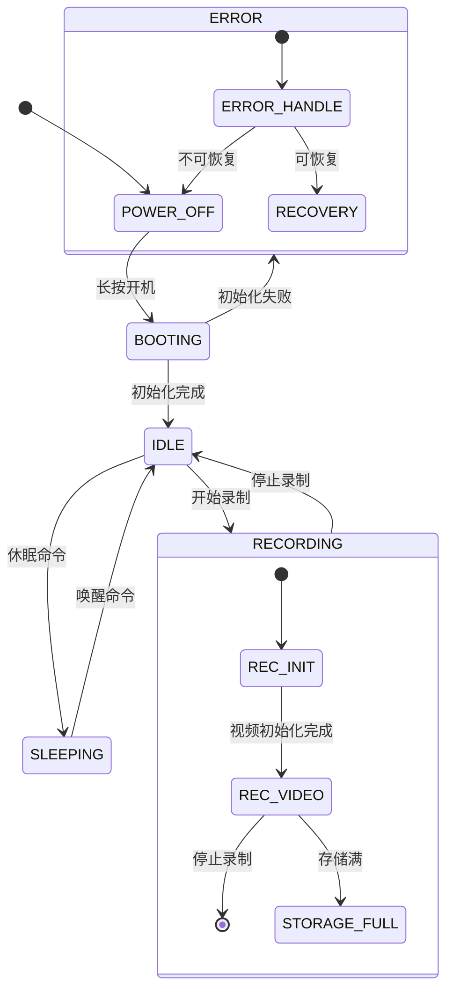

```mermaid
stateDiagram-v2
    [*] --> POWER_OFF
    POWER_OFF --> BOOTING: 长按开机
    BOOTING --> IDLE: 初始化完成
    BOOTING --> ERROR: 初始化失败

    IDLE --> RECORDING: 开始录制
    RECORDING --> IDLE: 停止录制

    IDLE --> SLEEPING: 休眠命令
    SLEEPING --> IDLE: 唤醒命令

    state RECORDING {
        [*] --> REC_INIT
        REC_INIT --> REC_VIDEO: 视频初始化完成
        REC_VIDEO --> [*]: 停止录制
        REC_VIDEO --> STORAGE_FULL: 存储满
    }

    state ERROR {
        [*] --> ERROR_HANDLE
        ERROR_HANDLE --> RECOVERY: 可恢复
        ERROR_HANDLE --> POWER_OFF: 不可恢复
    }
```